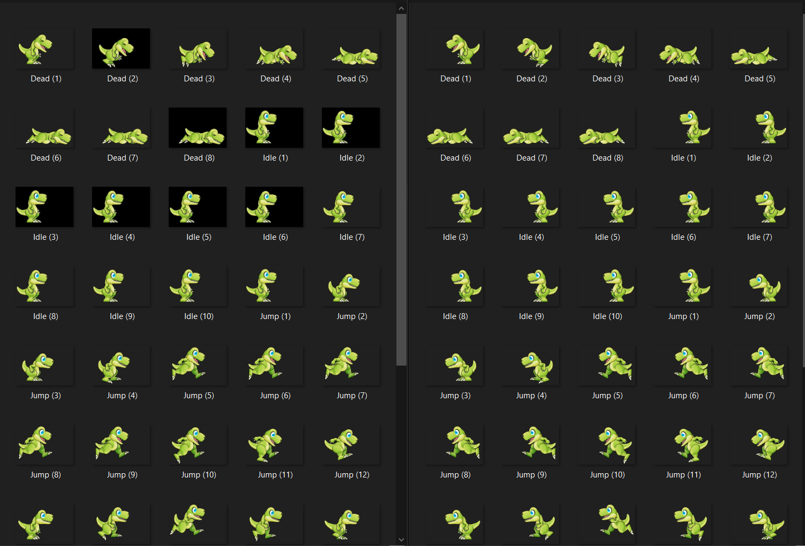

# Go Mass Image Mirroring (flip)

that's it

*Before -> After*



## Install

if you have Go installed on your machine, just do : `go get -u github.com/codenoid/go-mass-image-mirroring`

## Usage

```bash
$ go-mass-image-mirroring --help

Usage of go-mass-image-mirroring:
  -save string
        -save /path/to/save/mirror/result
  -source string
        -source /path/to/folder/that/contain/images
```
